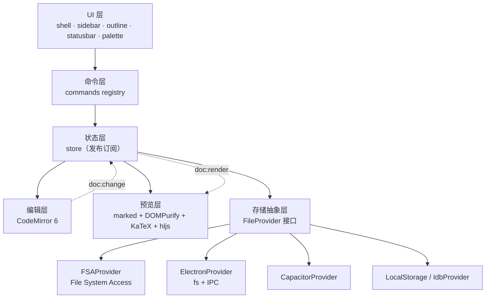

# MixMark 整体框架计划

> 极简 Markdown 文档编辑器 · 浏览器优先 · 本地优先 · 一次编写多端运行

- 文档版本：v0.1（2026-09-11）
- 状态：待评审
- 已确认决策：浏览器优先（双击 `web/index.html` 即可用） / 编辑器内核 CodeMirror 6 / 存储双轨（桌面走真实文件夹，浏览器兜底走应用内文档库）

---

## 1. 产品定位

**一句话**：本地优先、极简、能真正写东西的 Markdown 编辑器。

**不做**：云同步、账号体系、实时协作、插件市场、AI 续写（至少 M5 之前不做）。
**只做好一件事**：把「写 → 看 → 存 → 导出」这条链路做到又快又干净。

### 1.1 三条设计红线

| # | 红线 | 含义 |
|---|---|---|
| 1 | **零干扰** | 默认界面只有文字与一条细顶栏；侧栏/大纲/状态栏可折叠或按需自动隐藏 |
| 2 | **数据是自己的** | 文件以 `.md` 明文存放在用户自己的文件夹；无私有格式、无锁定、可直接被 VSCode / Git 管理 |
| 3 | **一次编写，多处运行** | 同一套 `web/` 源码 → 浏览器 / Windows 桌面 / Android，平台差异全部收敛在存储层 |

### 1.2 目标用户与典型场景

- 写技术笔记 / 课堂笔记的**学生**（中英混排、带数学公式、要导出 PDF 交作业）
- 写 README、设计文档的**开发者**（要能放进 Git 仓库）
- 需求：启动快、中文输入稳、公式能渲染、离线可用、不联网也能跑

### 1.3 竞品差异化

| 竞品 | 它的短板 | MixMark 的答案 |
|---|---|---|
| Typora | 收费、闭源、大而全 | 免费、极简、双击即用 |
| VSCode + 预览 | 重、启动慢、配置繁琐 | 秒开、零配置、开箱即用 |
| 各类在线 MD 编辑器 | 必须联网、内容存在别人服务器 | 完全离线、文件在自己硬盘 |
| Obsidian | 概念重（vault/插件/双链）、学习成本高 | 只有文件和文字 |

---

## 2. 技术选型

| 层 | 选择 | 理由 |
|---|---|---|
| 构建 | **不用构建**（唯一例外：vendor 用 esbuild 转 IIFE） | 「双击 index.html 即用」是产品红线，而 `file://` 下 ESM 被 CORS 拒绝，所以架构必须绕开一切运行时构建 |
| 语言 | 原生 ES5+ JavaScript（IIFE + `window.MM` 命名空间） | 无编译步骤 = 改完刷新即可见；本项目规模不需要 TS 的类型系统 |
| 编辑器内核 | **CodeMirror 6** | IME 稳、大文件稳、撤销栈成熟、扩展可拆分、按需引入 |
| Markdown 渲染 | `marked`（GFM） | 生态成熟、体积小、与既有技术栈一致 |
| 净化 | `DOMPurify` | 预览渲染必须过净化，防注入 |
| 公式 | `KaTeX`（含 woff2 字体，本地化） | 同步渲染、无 MathJax 的体积与闪烁问题 |
| 代码高亮 | `highlight.js`（只注册常用语言） | 体积可控；不用 Shiki（Node 依赖重） |
| 状态管理 | 自写极简 store（发布订阅，< 150 行） | 无需 Redux/Zustand |
| 存储 | **FileProvider 抽象层**（见 §4） | 同一份业务代码适配 4 种环境，是后续不返工的核心 |
| 桌面 | Electron + electron-builder + NSIS | 复用 EduPulse 已验证的打包/安装器流程 |
| 移动 | Capacitor | 同上 |
| 样式 | 原生 CSS + CSS 变量（设计令牌） | 主题切换靠变量覆盖，不引 UI 库 |
| 依赖分发 | **全部 vendor 本地化，禁止 CDN** | 离线可用是核心需求 |

### 2.1 关键决策：为什么是「构建一次，运行零构建」

`file://` 协议下浏览器会拒绝 ES 模块（CORS），因此 `web/` 在运行时**不能**有任何构建/打包依赖。方案：

```
开发期：tools/ 里用 Vite + TS 编译内核
        web/js/**.ts  ──build──▶  web/js/**.js      (IIFE / 全局命名空间)
        CM6 等依赖   ──build──▶  web/vendor/*.bundle.js  (IIFE)
运行期：web/ 是纯静态目录，<script src> 直接引入，双击 index.html 即可运行
```

- 产物**全部入库**（`web/js/`、`web/vendor/`），保证 clone 下来就能跑，无需 `npm install`
- 只在「升级编辑器内核 / 新增 vendor 依赖」时才需要跑构建
- 升级命令固化为 `npm run vendor` 与 `npm run build:web`

---

## 3. `file://` 协议约束清单（架构的硬边界）

「双击 `index.html` 就能用」这条要求，直接决定了以下限制。任何设计都必须绕开它们：

| 能力 | `file://` 下 | 影响 | 对策 |
|---|---|---|---|
| ES Module (`type="module"`) | ❌ 被 CORS 拒绝 | 不能直接引入 CM6 源码 | 全部打包成 **IIFE/UMD** 产物 |
| `fetch()` / `XHR` 本地文件 | ❌ 被拒绝 | 不能用 fetch 加载配置/模板 | 模板内联为 JS 字符串或 `<script type="text/plain">` |
| Web Worker | ❌ 起不来 | 大文档解析不能丢给 worker | 解析放在主线程 + 防抖 + 分片 |
| IndexedDB | ⚠️ Chrome 默认拒绝、Firefox 拒绝 | 浏览器兜底库无法用 IDB | 降级为 localStorage 文档库（见 §4.3） |
| File System Access API | ❌ `file://` 下不可用 | 双击模式不能直接读写磁盘 | 需在 http(s) 或桌面端启用（见 §4.4 分级） |
| `localStorage` | ✅ 可用 | 唯一可靠的兜底存储 | 作为 Tier A 文档库 |
| 图片/字体/CSS 子资源 | ✅ 一般可用 | KaTeX woff2 应能加载 | **M1 必须实测**，若被 CORS 拦则改为 base64 内联 |
| 剪贴板 API（富文本复制） | ⚠️ 部分受限 | 复制为富文本可能失败 | 提供 HTML 源码复制兜底 |

### 3.1 分级运行环境（Tier）

| Tier | 环境 | 可用的存储能力 | 用户体验 |
|---|---|---|---|
| **A** | 双击 `web/index.html`（`file://`） | localStorage 文档库 | 开箱即用，适合快速记录；一键导出 `.md` |
| **B** | 本地静态服务器 / GitHub Pages（`http(s)`） | IndexedDB + File System Access（可选） | 完整文档库 + 真实文件夹读写 |
| **C** | Electron 桌面端 | 主进程 `fs`，任意目录 | 完整能力，最佳体验 |
| **D** | Android (Capacitor) | Capacitor Filesystem | 完整能力，移动端 |

> 用户从 A 上手，随时可无损升级到 B/C/D —— 文档库通过「导出全部为 .md / zip」迁移。

---

## 4. 架构设计

### 4.1 分层



**铁律**：UI 层与编辑层**永远不直接 import 平台 API**，只调用 `FileProvider` 接口。平台差异只允许出现在 `web/js/provider/` 目录内。

### 4.2 核心接口

```ts
// ---------- 存储抽象 ----------
interface FileEntry {
  path: string;        // 相对根目录，形如 "notes/idea.md"
  name: string;
  isDir: boolean;
  size?: number;
  mtime?: number;
}

interface FileProvider {
  readonly kind: 'fsa' | 'electron' | 'capacitor' | 'local' | 'idb';
  readonly capabilities: {
    openFolder: boolean;   // 能否打开真实文件夹
    watch: boolean;        // 能否监听外部变更
    binary: boolean;       // 能否存图片等二进制
  };
  init(): Promise<void>;
  pickRoot(): Promise<string | null>;             // 选择根目录/工作区
  list(dir: string): Promise<FileEntry[]>;
  read(path: string): Promise<string>;
  write(path: string, content: string): Promise<void>;
  create(path: string, content?: string): Promise<void>;
  rename(from: string, to: string): Promise<void>;
  remove(path: string): Promise<void>;
  watch?(cb: (evt: FileChangeEvent) => void): () => void;  // 可选
}
```

```ts
// ---------- 文档模型 ----------
interface Doc {
  id: string;          // uuid，内存标识
  path: string;        // 存储层路径；Tier A 下为 "local://<id>.md"
  title: string;       // 派生：首个 H1 > 首个非空行 > 文件名
  content: string;
  ctime: number;
  mtime: number;
  dirty: boolean;      // 有未落盘修改
}

// ---------- 设置 ----------
interface Settings {
  locale: 'zh' | 'en';
  theme: string;             // 主题 id
  fontSize: number;
  lineWidth: number;         // 正文最大宽度（阅读舒适度）
  fontFamily: 'serif' | 'sans' | 'mono';
  viewMode: 'edit' | 'split' | 'preview';
  splitRatio: number;        // 0.2 ~ 0.8
  autoSave: boolean;
  autoSaveDelay: number;     // ms
  syncScroll: boolean;
  statusBar: 'always' | 'auto' | 'never';
  lastDocId?: string;
}
```

```ts
// ---------- 命令注册表（顶栏按钮 / 快捷键 / 命令面板 三处共用一份定义）----------
interface CommandDef {
  id: string;                // 'file.save' | 'format.bold' | ...
  titleKey: string;          // i18n key，双语
  defaultKey?: string;       // 'Mod+S'
  when?: (ctx: AppContext) => boolean;
  run: (ctx: AppContext) => void | Promise<void>;
}
```

> 命令注册表是「零重复」的关键：一个功能只定义一次，自动出现在**顶栏、快捷键、命令面板**三个入口。

### 4.3 存储分级策略（用户选定的「双轨」方案）

```
优先级探测（启动时自动降级）：
  Electron 可用?   ─▶ ElectronProvider（真实文件夹 + watch）
  Capacitor 可用?  ─▶ CapacitorProvider
  http(s) + FSA 可用? ─▶ FsaProvider（真实文件夹）
  以上都不是（file:// 双击）
                   ─▶ LocalStoreProvider（localStorage 文档库）
```

- **Tier A 文档库格式**：`mixmark:docs:index`（元数据数组）+ `mixmark:doc:<id>`（正文）
  - localStorage 配额约 5 MB，纯文本足够存数千页；接近 80% 时提示「导出并清理」
  - 首次启动即写入一份示例文档，保证用户打开就有东西可看
- **迁移路径**：设置里提供「导出全部为 .md（zip）」与「导入 .md 文件夹」，Tier A ⇄ B/C/D 无损互转

### 4.4 预览与同步滚动

```
content ──debounce(80ms)──▶ marked.parse ──▶ DOMPurify.sanitize ──▶ KaTeX renderMathInElement ──▶ hljs.highlightElement
```

- **同步滚动采用「源码行号映射」**，而非简单百分比：
  渲染时给每个块级元素写 `data-line="<起始行>"`，滚动时二分查找行号 → 对应元素 → 对齐视口。
  百分比方案在代码块/长段落下必然漂移，是同类产品的通病，不用。
- 大文档保护：内容 > 500 KB 或渲染耗时 > 300 ms 时，自动降级为「编辑模式 + 手动刷新预览」

### 4.5 自动保存与崩溃恢复

- 编辑停顿 `autoSaveDelay`（默认 1500 ms）后：Tier A 直接写 localStorage；Tier B/C/D 写盘
- 每 30 秒或每 50 次编辑，往 `mixmark:recovery` 写一份快照（覆盖式，只留最近 3 份）
- 启动时若发现恢复快照比文件新 → 弹「检测到未保存内容，是否恢复？」

---

## 5. 目录结构

```
MixMark/
├─ web/                          # 唯一业务源码（所有端的真身），运行期零构建
│  ├─ index.html
│  ├─ css/
│  │   ├─ tokens.css             # 设计令牌：色板/间距/字号/圆角/动效
│  │   ├─ theme.css              # 主题与强调色变量覆盖（浅/深/羊皮纸 × 5 色）
│  │   ├─ base.css               # 重置 + 排版基线 + 滚动条 + 焦点环
│  │   ├─ layout.css             # 应用外壳布局 + 三视图 + 响应式
│  │   ├─ components.css         # 文档列表 / 大纲 / 命令面板 / 对话框 / 设置页 / 提示条
│  │   ├─ editor.css             # CodeMirror 外观定制（#editor-host 作用域）
│  │   └─ preview.css            # 渲染结果排版（含 @media print）
│  ├─ js/
│  │   ├─ main.js                # 启动引导
│  │   ├─ core/
│  │   │   ├─ store.js           # 极简发布订阅
│  │   │   ├─ commands.js        # 命令注册表
│  │   │   ├─ settings.js        # 设置读写与迁移
│  │   │   ├─ docs.js            # 文档生命周期（开/关/存/脏标记）
│  │   │   └─ recovery.js        # 崩溃恢复快照
│  │   ├─ provider/
│  │   │   ├─ index.js           # 能力探测 + 自动选择
│  │   │   ├─ fsap.js
│  │   │   ├─ electron.js
│  │   │   ├─ capacitor.js
│  │   │   └─ localstore.js      # Tier A 兜底
│  │   ├─ editor/
│  │   │   ├─ cm-setup.js        # CM6 实例与扩展装配
│  │   │   ├─ md-syntax.js       # Markdown 高亮 + 行内样式
│  │   │   ├─ keymap.js          # 快捷键
│  │   │   └─ actions.js         # 加粗/斜体/链接/表格/公式等编辑动作
│  │   ├─ preview/
│  │   │   ├─ pipeline.js        # marked → sanitize → katex → hljs
│  │   │   ├─ line-map.js        # data-line 注入与二分查找
│  │   │   └─ scroll-sync.js
│  │   ├─ ui/
│  │   │   ├─ shell.js           # 顶栏 + 工具栏生成 + 视图切换 + 全局快捷键派发
│  │   │   ├─ sidebar.js         # 文档列表 / 大纲 两个面板 + 折叠
│  │   │   ├─ outline.js         # 标题大纲（点击跳转、跟随光标高亮）
│  │   │   ├─ statusbar.js
│  │   │   ├─ palette.js         # 命令面板 Ctrl+Shift+P
│  │   │   ├─ dialogs.js         # 输入框 / 确认框 / 自定义浮层
│  │   │   ├─ settings-page.js   # 设置页
│  │   │   ├─ app-commands.js    # file.* 文档命令 + edit.find
│  │   │   └─ toast.js
│  │   ├─ export/
│  │   │   ├─ md.js              # 导出 .md / 复制 Markdown（含 file:// 剪贴板兜底）
│  │   │   └─ pdf.js             # window.print() + @media print
│  │   └─ i18n.js                # 中英双语字典 STR.zh / STR.en
│  ├─ vendor/                    # 本地化依赖（IIFE 产物，入库）
│  │   ├─ codemirror.bundle.js   # window.CM
│  │   ├─ marked.js              # window.marked
│  │   ├─ purify.js              # window.DOMPurify
│  │   ├─ hljs.bundle.js         # window.hljs
│  │   ├─ katex/  katex.min.js · katex.min.css · fonts/*.woff2
│  │   └─ VENDOR.md              # 自动生成的依赖清单与版本
│  └─ assets/  icon.svg
├─ desktop/    Electron 壳
│              main.js · preload.js · lib/library-fs.js（纯 Node 磁盘层）
│              build/icon.ico（图标，打包必需的输入）
│              ※ 安装器由 electron-builder 的 NSIS target 生成，没有手写 .nsi
├─ android/    ⬜ Capacitor 壳工程（本版未做）
├─ tools/
│  ├─ build-vendor.js            # npm 依赖 → web/vendor 的 IIFE 产物（仅升级依赖时跑）
│  ├─ check-syntax.js            # 全量语法检查（web/js + tools）
│  ├─ serve.js                   # 本地静态服务器，用于验证 Tier B 的完整存储能力
│  ├─ vendor-entry/              # 供 esbuild 打包的 ESM 入口（CM6 / highlight.js）
│  └─ experiments/               # m1-smoke.html —— 关键风险冒烟测试，长期保留作回归用例
├─ docs/       PLAN.md · CHANGELOG.md
├─ release/    vX.Y.Z/ 归档（Setup exe / apk / web zip / CHANGELOG）
├─ package.json
├─ CLAUDE.md                     # 项目铁律 + 踩坑记录
└─ README.md
```

---

## 6. 界面骨架

```
┌──────────────────────────────────────────────────────┐
│ ☰  文件.md ▾              [编辑|分栏|预览]   ⌘  ⚙   │ 顶栏（可自动隐藏）
├──────────┬───────────────────────────────────────────┤
│ 文件树    │   ┌──────────────┬──────────────────┐    │
│ 大纲      │   │   编辑器      │     预览          │    │ 分栏模式
│ 搜索      │   │  (CM6)       │   (marked)       │    │
│ (可折叠)  │   └──────────────┴──────────────────┘    │
├──────────┴───────────────────────────────────────────┤
│ 1,234 字 · 行 42 · UTF-8 · 已保存 · Markdown         │ 状态栏
└──────────────────────────────────────────────────────┘
```

### 6.1 视觉方向（极简 / 内容优先）

- **排版即界面**：正文最大宽度 72ch 居中，行高 1.75，标题层级靠字重与留白区分，不靠线框
- **色彩克制**：中性灰阶为主，只用 1 个强调色（默认墨蓝）
- **留白大于装饰**：无阴影、无渐变、无圆角滥用（仅 4/8/12px 三档）
- **动效 120–180 ms**，仅用于面板开合与视图切换；尊重 `prefers-reduced-motion`
- **深浅双主题**，且都保证正文对比度 ≥ 7:1（WCAG AAA）

### 6.2 交互基线

| 快捷键 | 功能 |
|---|---|
| `Ctrl+Alt+N` | 新建文档 |
| `Ctrl+S` | 立即保存 |
| `Ctrl+B / I / K` | 加粗 / 斜体 / 插入链接 |
| `Ctrl+E` | 行内代码 |
| `Ctrl+Shift+X` | 删除线 |
| `Ctrl+Alt+1..3` | 标题层级 1–3 |
| `Ctrl+Shift+K` | 插入代码块 |
| `Ctrl+Shift+M` / `Ctrl+Shift+E` | 行内公式 / 块级公式 |
| `Ctrl+Shift+8` / `Ctrl+Shift+7` | 无序列表 / 有序列表 |
| `Ctrl+Shift+.` | 引用 |
| `Ctrl+Alt+V` | 循环切换 编辑 / 分栏 / 预览 |
| `Ctrl+\` | 折叠 / 展开侧栏 |
| `Ctrl+Shift+P` | 命令面板 |
| `Ctrl+Alt+,` | 设置 |
| `Ctrl+Alt+T` | 循环切换主题 |
| `Ctrl+F` | 查找与替换 |
| `Ctrl+P` | 打印 / 导出 PDF（浏览器原生，我们只提供打印样式） |

### 刻意避开的按键

浏览器保留了一部分快捷键，网页无法拦截。以下组合**没有**绑定，否则会出现
「命令面板里显示 Ctrl+N，按下去却打开了新窗口」这种自相矛盾的体验：

| 按键 | 浏览器行为 |
|---|---|
| `Ctrl+N` | 新窗口 |
| `Ctrl+T` | 新标签页 |
| `Ctrl+W` | 关闭标签页 |
| `Ctrl+1..9` | 切标签页 |
| `Ctrl+Shift+T` | 恢复关闭的标签页 |
| `Ctrl+Shift+V` | 粘贴为纯文本 —— 这一条**故意让给浏览器**，写 Markdown 时很有用 |
| `Ctrl+H` | 历史记录 |

---

## 7. 路线图

| 阶段 | 目标 | 交付物 | 验收标准 |
|---|---|---|---|
| **M0 骨架** ✅ | 能跑通空壳 | esbuild 产出 vendor IIFE、三视图切换、CSS 令牌、i18n 骨架、`web/index.html` 双击可开 | 双击打开无控制台报错；切模式正常；`node --check` 全绿 |
| **M1 核心编辑** ✅ | 能写能看 | CM6 接入 + Markdown 高亮 + 实时预览 + 行号映射同步滚动 + KaTeX + 代码高亮 + 快捷键 + 命令面板 + 自动保存/崩溃恢复 + 本机文档库 + 导出 .md/PDF | 已达成（见 `CHANGELOG.md`）；**待人工验收**：微软拼音在编辑器内的实际手感 |
| **M2 文件系统** ✅ | 能存能管 | FileProvider 四实现、打开文件夹、文件树、多标签、全文搜索、导入导出迁移 | 已达成：IDB 后端（Tier B 自动启用）+ FSA 本地文件夹（真实读写任意目录、多级文件夹）+ 全文搜索。**偏差**：多标签与迁移向导未做（见下），改为「切存储 + 导出全部 .md」 |
| **M3 导出与打磨** ✅ | 能发出去 | 导出单文件 HTML（字体内联）、主题深化、查找替换增强 | **已完成**：① 查找替换；② 单文件 HTML 导出（构建期字体内联、零外部引用、跟随当前主题与正文字体）；③ **迁移链路**（导出全部为 .zip 含文件夹结构、导入文件夹含子目录）；④ **主题深化** —— 底色主题 6 套、强调色 8 个、字体档位 4 档（界面/正文分开选），48 套配色 × 1632 项对比度检查全过。范围由用户定为「不同文字颜色、字体、主题色都做」，已交付 |
| **AI 助手** ✅（路线图外，用户直接提的需求） | 写作与学习助手 | 侧栏对话面板、DeepSeek 工具调用、引用机制、结构改动与撤销 | **已完成**：读/写/建/搜 + 看状态 + 5 个结构类工具；三种引用来路（行号复选框、侧栏拖入、关键词自动挂）与可逐个取消的引用条；面板高度可拖；改动走「提案 → 保留/撤销」，结构改动即时生效并可一键撤销；幻觉三重防线 + 能力边界写在系统提示词里 |
| **M4 打包** ✅（桌面端） | 上桌面 | Electron + NSIS 安装器、应用图标 | **已完成**：文档真的以 `.md` 落进用户自选的文件夹（索引 + 镜像双层，中文文件名、重名去重、虚拟文件夹镜像成真实子目录、首次连接收编已有 .md/.txt）；原生中文菜单与页面共用同一套命令；`--library <文件夹>` 启动即连；装机实测可启动、可连接、可读写。`desktop/tools/check-fs.js` **42 项**磁盘层自测全过 |
| **M4 剩余**（移动端） | 上手机 | Capacitor APK、启动图与自适应图标 | 本次未做，用户明确「只用 exe，不用 apk」 |
| **M5 增强**（可选） | 差异化 | 专注模式、打字机滚动、表格可视化编辑、粘贴图片转本地相对路径、自动快照 | 用户愿意日常使用（自测 2 周无回归） |

**交付节奏建议**：M0+M1 合为一次交付（可用的编辑器）→ M2 → M3 → M4。

<!-- M0 + M1 已于 2026-09-11 交付，实现细节与技术决策见 docs/CHANGELOG.md -->

---

## 8. 风险与对策

| # | 风险 | 影响 | 对策 |
|---|---|---|---|
| 1 | `file://` 下 ES 模块/字体/IDB 被 CORS 拦截 | 双击模式功能残缺 | 全部 vendor 走 IIFE；IDB 降级 localStorage；KaTeX 字体**在 M1 第一周实测**，失败则 base64 内联 |
| 2 | 中文 IME 在编辑器内丢字/候选框错位 | 中文用户直接弃用 | M1 第一个验证项就是微软拼音 + 搜狗压测；不达标立刻换方案（CM6 之外备选：自绘 textarea 叠加层） |
| 3 | 大文档（>1 MB）预览卡顿 | 体感崩坏 | 防抖 + 行号注入的成本控制 + 超阈值自动降级为纯编辑模式 |
| 4 | 三端代码分叉 | 维护成本爆炸 | 平台差异全部锁在 `provider/`；加 lint 规则禁止 UI 层 import 平台 API |
| 5 | localStorage 5 MB 配额被打满 | Tier A 用户丢失新内容 | 80% 时提示导出并清理；写入失败给出明确错误而非静默失败 |
| 6 | 同步滚动漂移 | 分栏模式体验差 | 行号映射方案（非百分比）；代码块/表格特殊对齐处理 |
| 7 | 打包体积膨胀（KaTeX 字体 + hljs 语言包） | 下载慢 | KaTeX 只带 woff2；hljs 只注册常用 15 种语言 |
| 8 | 缓存导致改版不生效 | 用户看到旧版 | 沿用铁律：`web/index.html` 的 `?v=N` 每次全部 +1 |
| 9 | 预览渲染 XSS | 安全问题 | `DOMPurify` 强制过滤；禁用 `marked` 的 raw HTML 直通（可配置项默认关闭 HTML） |

---

## 9. 工程铁律（沿用已验证的项目约定）

1. 文案必须中英双语：一律走 `js/i18n.js` 的 `STR.zh` / `STR.en`，禁止硬编码字符串
2. 改完 JS 先 `node --check` 全部文件
3. 所有依赖本地化，禁止 CDN 引用
4. 改 `css`/`js` 后 `web/index.html` 的 `?v=N` 全部 +1
5. 不用 `t` 作局部变量名（遮蔽全局翻译函数 `t()`）
6. PowerShell 里用 `npm.cmd` / `npx.cmd`（执行策略禁止 `npm.ps1`）
7. 版本号维护四处：`package.json`、`desktop/package.json`、`web/js/main.js` 的 `MM.VERSION`、`web/index.html` 的 `?v=N`
8. 需要走代理推送时：`git -c http.proxy=<代理地址> push`
9. 改完 `web/` 后重新打包桌面端：`cd desktop && npm run build`（`copy-web` 会把 `web/` 同步进 `app/`）
10. 项目约定与踩坑记录写进 `CLAUDE.md`

### 9.1 命名规范

| 类型 | 规则 | 示例 |
|---|---|---|
| 文件 | kebab-case | `scroll-sync.js` |
| 目录 | 小写单词 | `provider/` |
| 全局模块 | 单个 `MM` 命名空间 | `MM.store`、`MM.commands` |
| CSS 变量 | `--mm-` 前缀 | `--mm-accent`、`--mm-text-1` |
| 命令 id | `域.动作` | `file.save`、`format.bold` |
| i18n key | 驼峰 | `cmdSave`、`dlgUnsavedTitle` |

---

## 10. 下一步

M0 + M1 已于 2026-09-11 交付；M2 随后交付（详见 `docs/CHANGELOG.md`）。接下来的优先顺序：

1. **人工验收中文输入法**（自 M1 起挂账至今，优先级最高）：打开 `tools/experiments/m1-smoke.html`，
   用微软拼音实际输入一段长文，确认候选框跟随、无丢字、无光标错位。
2. **人工验收本地文件夹与磁盘直连**：因需要系统选目录/选文件弹窗（必须有真实点击手势），
   自动化测不了。跑 `npm.cmd run serve` → 「文件 → 连接本地文件夹」选一个目录，
   再用「文件 → 打开文件」挑一个已有的 `.md`，确认：文档以 .md 落盘、
   改完按保存会写回**原文件**、关掉浏览器重开能恢复、重命名/移动文件夹结果正确。
3. **补 M2 欠账**：多标签页（同时开多篇）、图形化跨存储迁移向导（现在只能导出 .md 手动搬）。
4. **M3 已完成**：单文件 HTML 导出、文档内查找替换、迁移链路、主题深化四项均交付。
   主题深化的范围由用户定：「多做几套主题，包括不同文字颜色、字体、主题色」——
   已得到 6 底色 × 8 强调色 × 4 字体档，且每一套都过了对比度审计。

下一阶段的重点回到 M4（桌面端 / 移动端外壳），它才是「数据真落到自己硬盘」的
最后一环 —— M2/M3 把浏览器路径做完了，但 Tier A 的文档库终究在 localStorage 里。

**2026-09-13 更新：桌面端已交付。** `web/` 的代码一行没改就装进了 Electron 壳，
多出来的只是一个新后端。这反过来验证了 M2 定的那条约定是对的：
上层只见逻辑键，换后端换介质时一行不用改。安卓端（Capacitor）本次未做。

### 已闭环的验证结论

| 验证项 | 结论 |
|---|---|
| `file://` 下加载 IIFE 经典脚本 | ✅ 成立，CM6 618KB bundle 正常 |
| `file://` 下 KaTeX woff2 字体 | ✅ 成立，未被 CORS 拦截（已激活 Main / Math / Size2） |
| 双向同步滚动 | ✅ 成立，行号映射方案无漂移 |
| 启动无控制台报错 | ✅ 成立 |
| 中文输入法手感 | ⏳ 待人工确认 |

---

## 附录 A：与 EduPulse 的复用清单

| 复用项 | 来源 | 用途 |
|---|---|---|
| Electron + electron-builder + NSIS 流程 | `EduPulse/desktop` | 桌面打包与安装器 |
| Capacitor 安卓壳与图标/启动图生成 | `EduPulse/android` + `tools/gen-icons.js` | 移动端 |
| `published-web.js` 热更新思路 | `EduPulse/tools` | 可选：Web 版热更新 |
| i18n 双语字典结构 | `EduPulse/web/js/i18n.js` | 直接沿用结构 |
| UI 铁律与踩坑记录 | `EduPulse/CLAUDE.md` | 初始化本项目 `CLAUDE.md` |
| `?v=N` 缓存失效机制 | `EduPulse/web/index.html` | 沿用 |

## 附录 B：明确不做的事（防止范围蔓延）

- ❌ 云同步 / 账号 / 多人协作
- ❌ 双链笔记 / 知识图谱 / 插件系统
- ❌ 所见即所得（WYSIWYG）实时隐藏标记 —— 保持「源码 + 预览」的诚实模式
- ❌ 内置图床、上传、分享链接
- ❌ 移动端做完整编辑体验（移动端定位为「查看 + 轻量修改」）
